# AI-Based Form Builder — Detailed Architecture

**Project:** PCP Admin Portal — Form Builder AI Assist
**Source of truth:** *AI-Form-Builder-Plan-v2* (design/planning document)
**Purpose:** A detailed architectural reference derived from the plan. This document illustrates the target architecture of the feature — the components, boundaries, data flows, control flows, and contracts — using layered diagrams.

> This is a design artifact based on the plan, not on any current implementation state. Everything shown here reflects the intended architecture described in the plan.

---

## 1. System Context (C4 Level 1)

The feature spans three deployables: the admin browser (Form Builder), a dedicated AI backend service, and the citizen portal that renders the saved form. The LLM is an external, config-selected dependency.

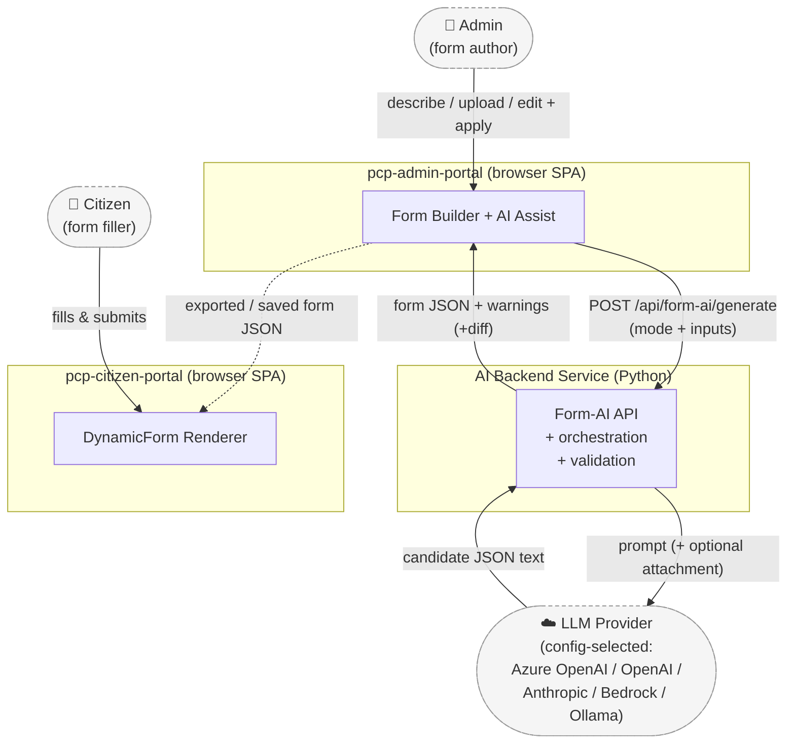

**Key boundary decision (plan §3):** the LLM call lives on the backend so the API key never ships in the browser bundle, validation is centralized, and providers can be swapped behind one interface.

---

## 2. Container / Component View (C4 Level 2)

The plan attaches the feature to real integration points. This view shows the concrete components on each side and how they connect.

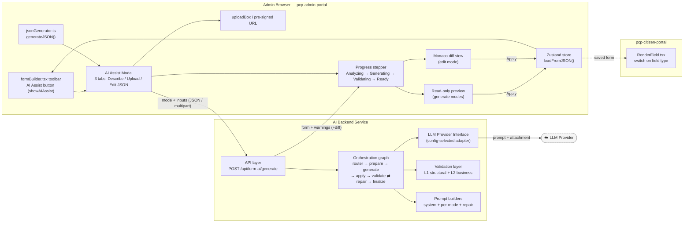

### 2.1 Frontend integration points (plan §2.1, §5)

| Component | Role in the feature |
|---|---|
| `formBuilder.tsx` toolbar | Hosts the **AI Assist** button (after Export), driven by `showAIAssist` `useState` — mirrors `showImport`. |
| AI Assist modal | Three tabs, each with an **instruction text area**. |
| `generateJSON()` (`jsonGenerator.ts`) | Prefills the Edit-JSON tab. Note: output **starts at `sections`**, omits top-level metadata. |
| `uploadBox` / pre-signed URL | Reused for the document upload tab. |
| Monaco editor | Edit-mode diff (original vs modified). |
| `loadFromJSON()` (Zustand store) | The **only** path into the store; reused from manual JSON import. Re-derives `order`, autosaves `formBuilder_draft`. |

### 2.2 Backend components (plan §4)

| Component | Responsibility |
|---|---|
| API layer | Accepts JSON or multipart; enforces per-mode instruction rules; wraps in `apiPayload` envelope. |
| Orchestration graph | Directed node graph with a bounded validate→repair loop. |
| LLM Provider interface | Vendor-agnostic contract: text prompt in, clean JSON text out, optional attachment. |
| Validation layer | Two levels — structural (schema) + business rules. |
| Prompt builders | One shared system prompt + mode-specific user prompts + repair prompt. |

---

## 3. Backend Orchestration Graph (control flow)

The heart of the backend (plan §4.3–4.4). Each node does one job; a conditional edge implements the self-correcting **validate → repair** loop, hard-capped so it can never loop forever.

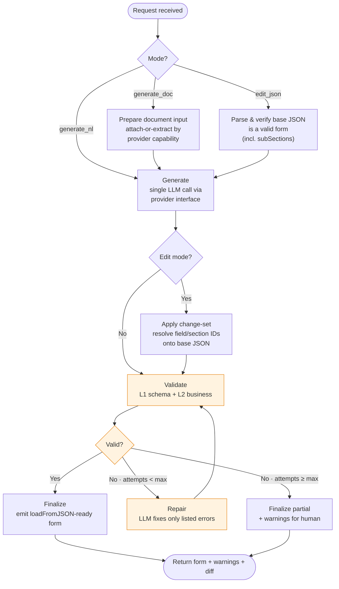

**Loop safety (plan §9):** the repair edge increments an attempt counter; once it hits `max`, the graph bails to a best-effort finalize with warnings rather than retrying forever.

---

## 4. LLM Provider Abstraction (plan §4.2)

The backend depends only on a narrow interface. The active provider is chosen by env (`LLM_PROVIDER`); switching = change env + restart, no feature-code change.

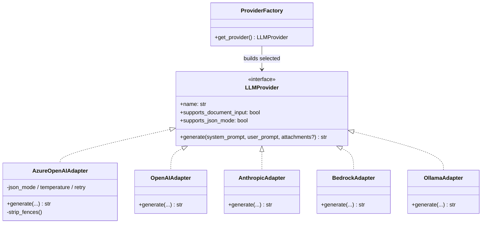

**Adapter responsibilities (hidden behind the interface):**
- Normalize output to **clean JSON text** (strip markdown fences, unwrap envelope) so the validator always sees the same contract.
- Own vendor knobs: temperature, max tokens, JSON mode, retry/backoff, attachment encoding.
- Declare capabilities so the graph can branch (e.g. document attach vs text extraction).

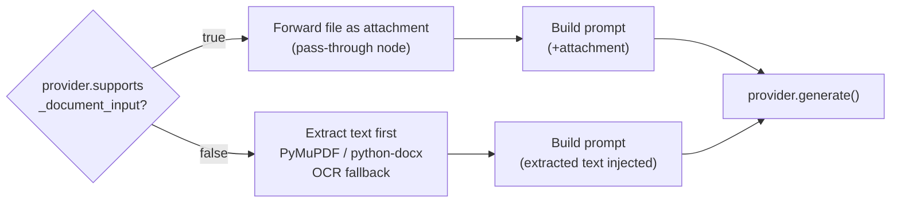

> The **frontend contract does not change** regardless of provider capability.

---

## 5. Validation Layer (plan §4.5)

Two levels run before any output reaches the browser. Failures produce specific, path/id-tagged messages the repair step can act on.

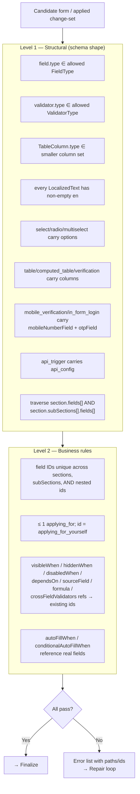

**Why both levels matter (plan §2.1–2.2):**
- The manual import path (`handleImport`) does **no** structural check — this validation layer is the safety net.
- `RenderField.tsx` has no case for a hallucinated type, so it silently won't render — structural validation prevents that.
- The store only *warns* on duplicate top-level ids and never checks nested ids — business validation enforces true uniqueness.

> **Recommended:** generate the schema from `formBuilder.types.ts` so allowed lists and nested shapes never drift from the source of truth.

---

## 6. Frontend Flow (plan §5.6)

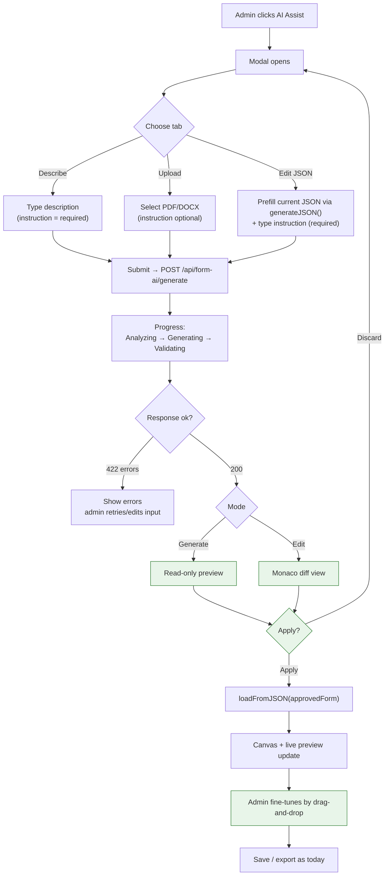

**Human-in-the-loop (plan §5.4):** the AI never writes to the store. Preview/diff + **Apply** is the only path in. Because Apply overwrites the autosaved `formBuilder_draft`, the UI warns on unsaved work first.

---

## 7. End-to-End Sequence (all modes) (plan §6)

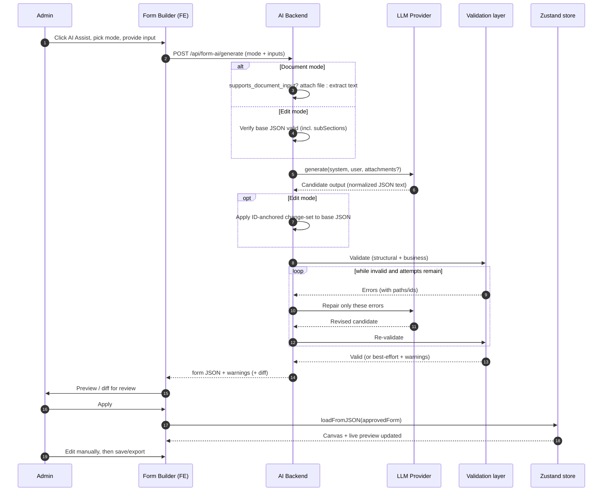

---

## 8. API Contract & Data Model (plan §4.6–4.7)

### 8.1 Request

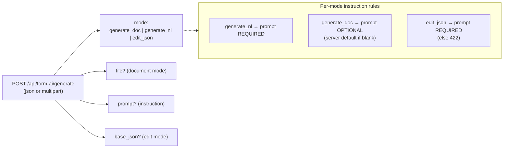

### 8.2 Responses

| Status | Body | When |
|---|---|---|
| **200** | `{ form, warnings[], diff? }` | Success; `diff` present in edit mode only. |
| **422** | `{ errors[] }` | Unrecoverable after the repair budget. |

### 8.3 Output contract (flat, `loadFromJSON`-ready)

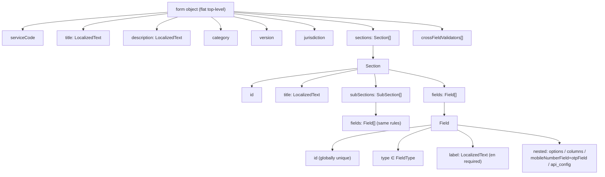

> `order` is omitted — the store re-derives it from array position. `subSections`, when present, obey all field rules.

---

## 9. Three Modes at a Glance (plan §1.1, §11)

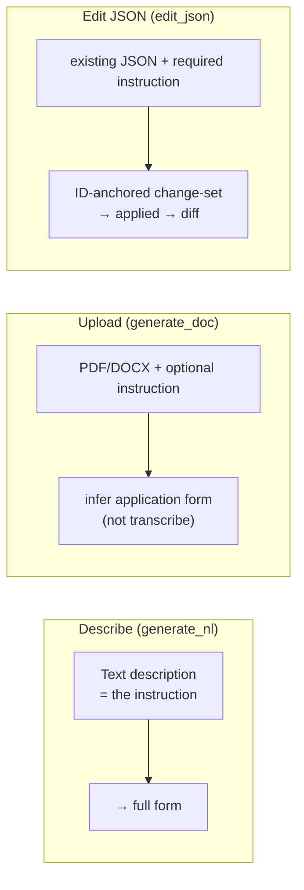

Each mode uses the **shared system prompt** (schema rules) + a **mode-specific user prompt** (admin input). The repair loop uses a dedicated repair prompt seeded with the exact validation errors.

---

## 10. Cross-Cutting Concerns

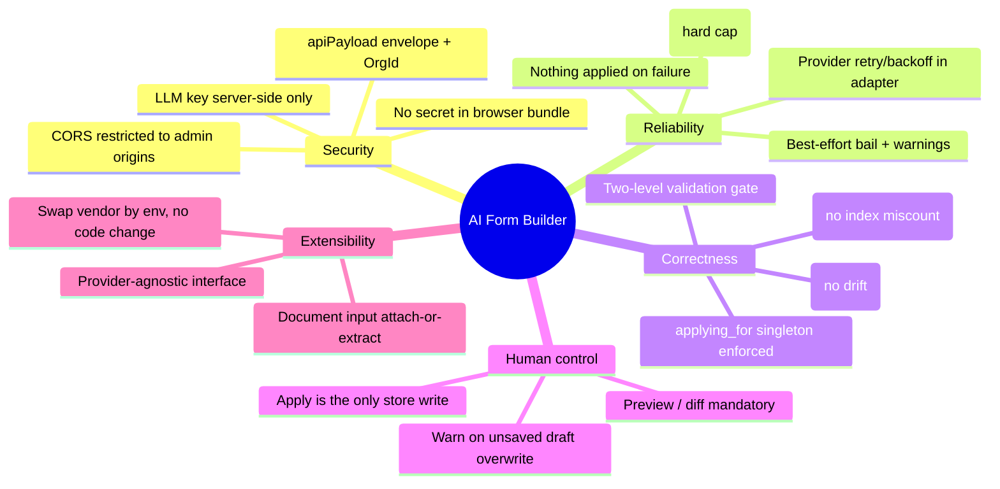

---

## 11. Component-to-Plan Traceability

| Architecture element | Plan section |
|---|---|
| System context / why separate backend | §3 |
| Frontend integration points | §2.1, §5 |
| Provider abstraction & capability branch | §2.3, §4.2 |
| Orchestration graph & node responsibilities | §4.3, §4.4 |
| Validation (structural + business) | §4.5 |
| Output contract (flat form) | §4.6 |
| API contract (request/response) | §4.7 |
| Frontend flow & review-before-apply | §5.3–5.6 |
| End-to-end sequence | §6 |
| Prompts (system / mode / repair) | §11 |
| Reliability & safety | §9 |

---

*This architecture document is derived from the AI-Form-Builder-Plan-v2 design artifact. It describes the intended architecture of the feature.*
